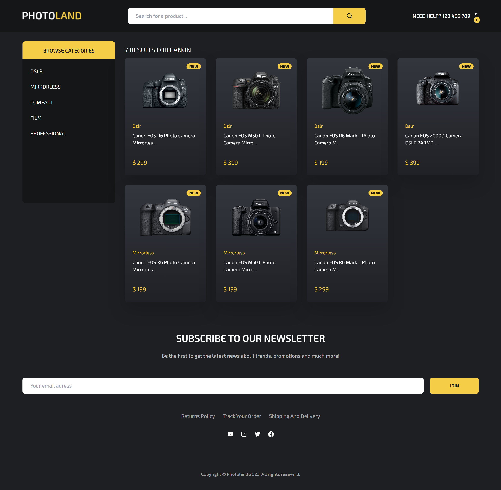

# Photoland E-commerce

## ⚡ Tecnologias utilizadas:




> O projeto em tela foi idealizado por Cristian Mihai em seu canal na plataforma YouTube: https://www.youtube.com/watch?v=zMUw7IUfQEk&t=14099s. Fiz passo a passo para colocar em prática conceitos teóricos aprendidos em âmbito acadêmico e criei esse repositório para compartilhar o resultado.

### Ajustes e melhorias

O projeto ainda está em desenvolvimento e as próximas atualizações serão voltadas nas seguintes tarefas:

- [x] Integração com Stripe;
- [x] Alteração no estilo;
- [x] Documentação;

## 💻 Pré-requisitos

Antes de começar, verifique se você atendeu aos seguintes requisitos:

* Você tem uma máquina `<Windows / Linux / Mac>`. 
* Você instalou a versão mais recente ou LTS do `<Node.js>`

## 🚀 Instalando

Para instalar o projeto, siga estas etapas:

Windows:
```
<npm install>

<npm start>

Abra http://localhost:3000 para ver o projeto em seu browser.